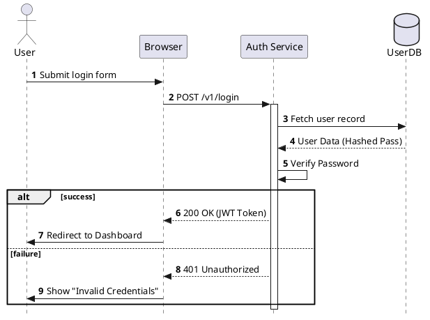

# 🛠️ PlantUML Mastery: The Complete Guide

This document provides a comprehensive overview of PlantUML, from basic syntax to professional architecture patterns.

---

## 📖 1. Quick Reference Tables

### Core Syntax Cheat Sheet
| Feature | Syntax | Diagram Type |
| :--- | :--- | :--- |
| **Participants** | `actor`, `participant`, `database` | Sequence |
| **Flow Control** | `if`, `else`, `endif` | Activity |
| **Loops** | `while`, `endwhile` | Activity / Sequence |
| **State Transitions**| `[*] --> State1` | State |
| **Visibility** | `+` (public), `-` (private) | Class |
| **Styling** | `!theme <name>` | All |

### Relationship Symbols
| Symbol | Meaning | Use Case |
| :--- | :--- | :--- |
| `->` | Synchronous Request | Sequence |
| `-->` | Asynchronous/Response | Sequence |
| `<|--` | Inheritance (Is-a) | Class |
| `*--` | Composition (Must have) | Class |
| `o--` | Aggregation (Can have) | Class |

---

## 🚀 2. Practical Code Examples

### A. Sequence Diagram (User Authentication)
The most common diagram for documenting APIs and Auth flows.


# 📊 PlantUML Syntax & Commands Reference

| Category | Command / Syntax | Visual Result / Purpose |
| :--- | :--- | :--- |
| **Basic** | `@startuml` ... `@enduml` | Defines the start and end of any diagram. |
| **Sequence** | `actor`, `participant`, `database`, `queue` | Defines different types of entities/icons. |
| **Arrows** | `->` (Solid), `-->` (Dotted), `->>` (Arrowhead) | Shows direction and type of communication. |
| **Logic (Seq)** | `alt/else` (If), `loop` (For), `par` (Parallel) | Controls flow within a sequence diagram. |
| **Activity** | `start`, `stop`, `:Action;` | Defines the beginning, end, and steps of a process. |
| **Activity If** | `if (cond) then (yes) ... else (no) ... endif` | Creates branching logic in flowcharts. |
| **Class** | `class Name { +field \n #method() }` | Defines classes with visibility (`+` public, `-` private). |
| **Relations** | `<|--` (Inherit), `*--` (Compose), `o--` (Aggregate) | Shows how objects connect in architecture. |
| **States** | `[*] --> StateName`, `State1 -> State2` | Defines transitions in a State Machine. |
| **Notes** | `note right of Object : Message` | Adds a yellow sticky note for context. |
| **Styling** | `!theme cerulean`, `skinparam handwritten true` | Changes the entire look and feel of the diagram. |
| **Deployment** | `node`, `folder`, `cloud`, `frame` | Visualizes infrastructure and physical grouping. |

---

### 🎨 Quick Color & Arrow Reference

| Syntax | Effect |
| :--- | :--- |
| `A -> B #red` | Changes the arrow color to red. |
| `A -[hidden]-> B` | Aligns elements without showing a line. |
| `participant B #00FF00` | Fills a participant box with a specific Hex color. |
| `title My Diagram` | Adds a bold title to the top of the image. |

---

### 🚀 Pro-Tip: Multi-Page Exports
If your diagram is too long, use the `newpage` command to split it into separate images when exporting:

```puml
@startuml
:Step 1;
newpage
:Step 2 (On a new image);
@enduml
```
# generate PNG from file (requires plantuml.jar and Java)
java -jar path\to\plantuml.jar 09-Timing-Diagram\basic-timing.puml
java -jar path\to\plantuml.jar 09-Timing-Diagram\diagram.puml
